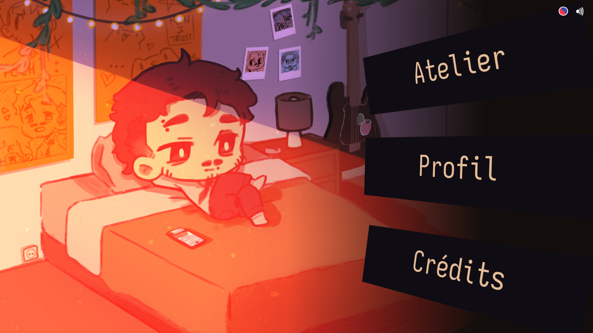
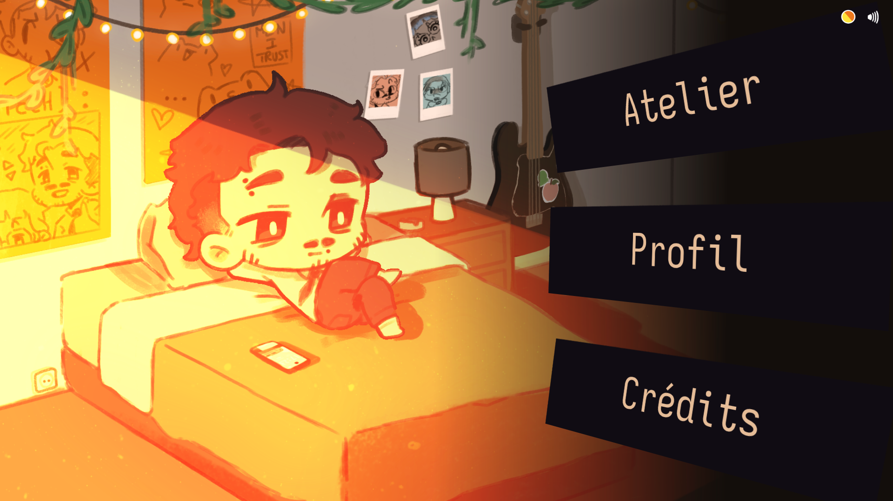
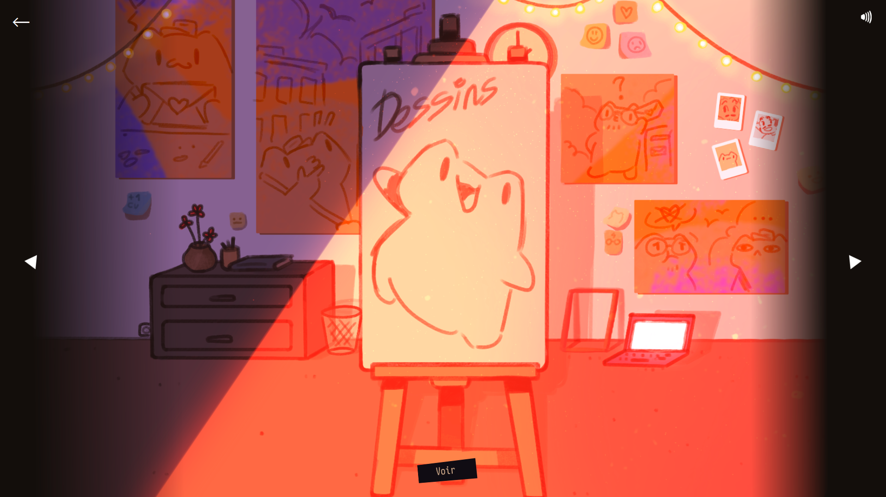
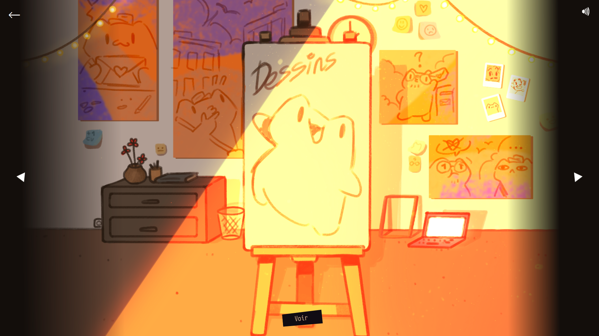
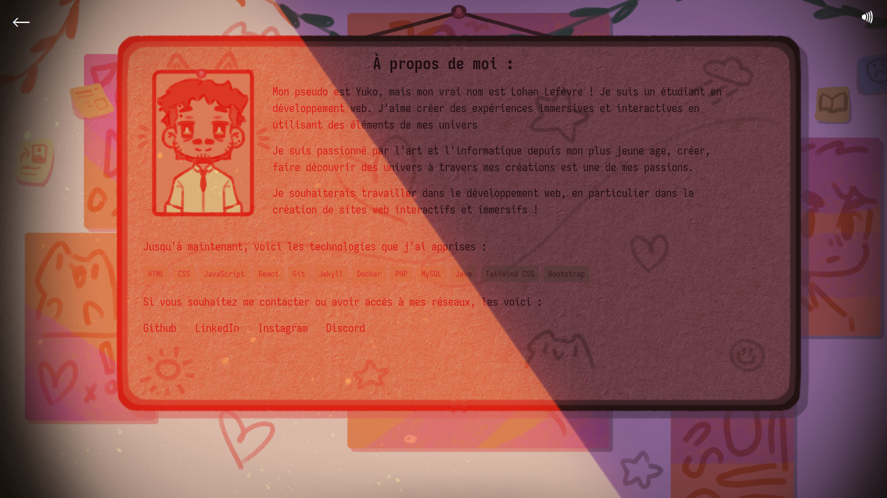
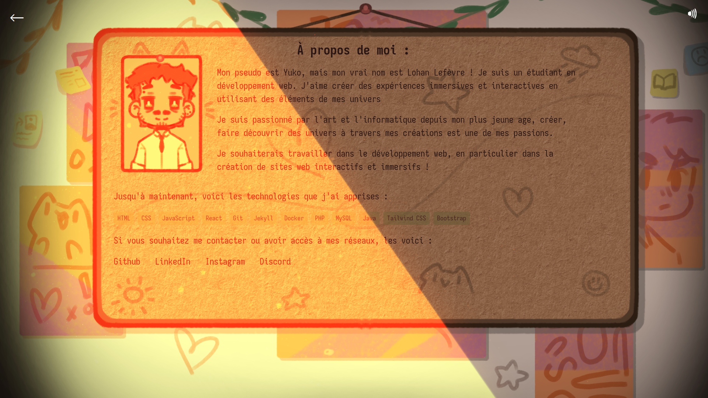
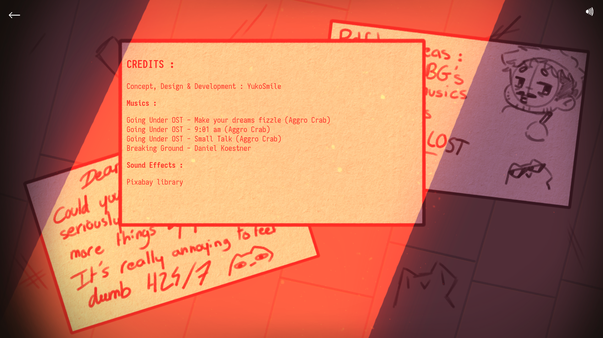
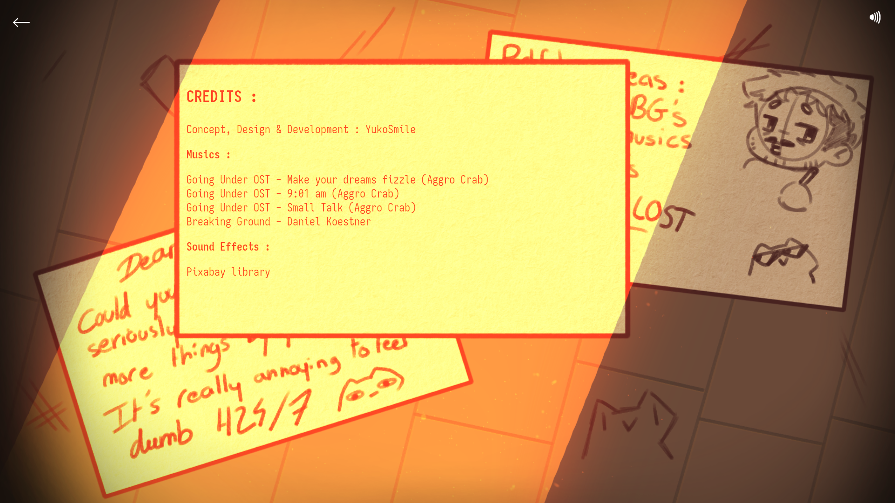

# Portfolio Perso (React + Vite)

### ⚠️ Ce portfolio n'est pas un site abouti, je l'ai principalement effectué pour apprendre et m'améliorer en React!

---

Dans ce portfolio, vous trouverez la plupart de mes dessins, croquis, animations ainsi que mes réseaux et quelques informations sur moi !

- Toutes les musiques et les sons sont crédités dans la page [crédits](https://lohanl3f.github.io/PortfolioYuko-React/#/credits) 🙂‍↕️

Voici le lien pour visiter le site, bonne découverte !
[CLIQUEZ ICI](https://lohanl3f.github.io/PortfolioYuko-React/)

---

Screenshots du site : 

**Accueil** :

  

---

**Atelier** :

 

---

**Profil** :

  

---

**Credits** :

  

---